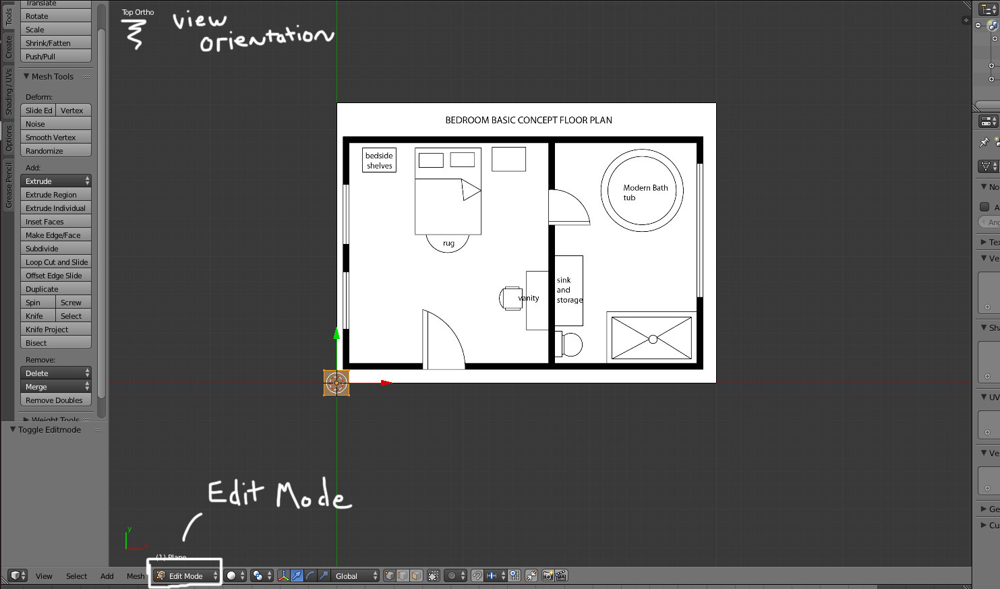
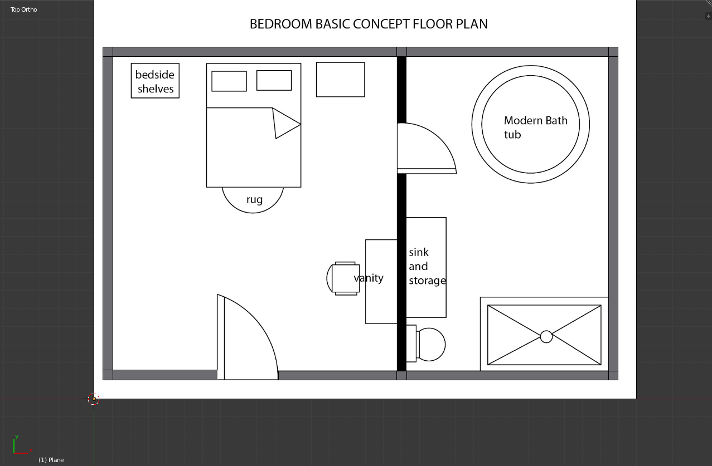

# Intro


Following the shooting at Pulse night club, we at the _Tampa Bay Times_ knew we wanted to tell the story in a way that was more concrete than just words on a page. We decided to create a [3d graphic](http://www.tampabay.com/pulse) that would tell the story of that night’s events.

There were two teams that worked together, in parallel, to create the graphic. One was a full team of reporters, photographers, and editors - both in the office and on scene in Orlando - who found bits of information, like the Pulse floor plan filed with the city, and stories from survivors. From these threads, they built a narrative of that night’s events.

The other team was focused on tech. The tech team (composed of Nathaniel Lash, Eli Zhang, Martin Frobisher, and myself) had two goals. The first was to get a 3d model animating on the page; the second was to do it in a way that was flexible enough that the visual could quickly evolve as the reporting team edited and refined the narrative.

In this article I talk about how we met those two goals. This article is a low-level technical tutorial and assumes only that the reader knows how to write vanilla es5 javascript but experience with OOP will be helpful. By the end of the article, you will have built [this](http://linklink). 

[Link to repo](https://github.com/ejmurra/3d-story)

##Table of contents
* [Setting up your project](#setting-up-your-project)
	* [Project structure](#project-structure)
	* [Gulp, ES6 and Browserify](#gulp-es6-and-browserify)
* [Modeling](#Modeling) (using the free software, Blender)
	* [A brief tour of Blender](#a-brief-tour-of-blender)
	* [Laying the foundations](#laying-the-foundations)
	* [Putting up walls](#putting-up-walls)
* [Getting it on the page](#getting-it-on-the-page)
	* [The Threejs editor](#the-threejs-editor)
	* [Getting our toes wet with es6](#getting-our-toes-wet-with-es6)
	* [Creating a RenderManager](#creating-a-rendermanager)
* [Telling a story](#telling-a-story)
	* [Animations with tweenjs](#animations-with-tweenjs)
	* [Creating a scene manager](#creating-a-scene-manager)
	* [Finishing our controller with Swiper](#finishing-our-controller-with-swiper)

# Setting up your project

For this project, we will be working with a modern toolkit. Npm will help us manage third party dependencies, and Babel will allow us to take advantage of ES2015 (aka es6) features such as classes, lexically scoped variables and functions, default parameters with destructuring and more. In this section, we’ll show you how we set it up.

ES2015 is the newest version of javascript, standardized last year and already in [most modern desktop browsers](http://kangax.github.io/compat-table/es6/). It’s not as well supported on mobile, so we’ll use Babel to transpile (or convert) our ES2015 code into a version of javascript that can run on those browsers (es5). We’ll talk about setting up the transpilation process in the subsection, [Gulp, ES6 and Browserify](#gulp-es6-and-browserify). We’ll talk about ES2015 features as we start to write code; you can find a detailed list of new features [here](https://babeljs.io/docs/learn-es2015/).
## Project structure
```
|- resources
|- src
    |- main.js
|- index.html
```
The structure for this project is very simple. We have an `index.html` page, a `resources` directory, and a `src` directory. 

Put the following in `index.html`:
```HTML
<!DOCTYPE html>
<html lang="en">
<head>
  <meta charset="UTF-8">
  <title>3D Story</title>
</head>
<body>

<div id="display"></div>

<!-- This is a polyfill for es6 functionality -->
<script src="https://cdnjs.cloudflare.com/ajax/libs/babel-polyfill/6.9.1/polyfill.js"></script>

<!-- This is where our transpiled script will be -->
<script src="resources/main.js"></script>
</body>
</html>
```

The `resources` directory is where we will put any assets we want to use directly on the page such as css, images, or json to be loaded via ajax calls.
The `src` directory will contain our _source files_ or code that we write directly. This code will be run through a _transpiler_, which will transform the code we write (es6 code) into code that can be read on all browsers (es5 code). For now, we will have a blank file in there, `main.js`.

## Gulp, ES6 and Browserify

Once you have created the skeleton project, run `npm init` in your terminal. (If you get an error, make sure you have node and npm installed and in your path.) Fill out the prompts (or run `npm init -f` to just use the defaults) and npm will create  a `package.json` file in your directory. This file is essentially metadata on your project and dependencies.

Now that we have a `package.json` we can install our dependencies. First, let’s install our build dependencies. Run `npm install --save-dev browserify babel-preset-es2015 babelify gulp`. The `--save-dev` flag will log these dependencies to the `package.json` file we just created.

After the dependencies have been installed, we will create `gulpfile.js` in our root directory. A gulpfile is used by the [gulp build tool](https://github.com/gulpjs/gulp) to create _tasks_ which we can run on our project. Common tasks include _copying resource images to the build directory_, _transpiling sass into css_, and _transpiling es6 into es5_. For this project we are going to keep it simple and create only two tasks.

Our first task is going to read our code in the `src` directory, transpile it, go collect all of its dependencies, and put the output in the `resources` directory. When the project is finished, we can host it on our site by copying `resources` and `index.html` onto a file server.

Add the following to `gulpfile.js`:

```javascript
var gulp = require('gulp');
var browserify = require('browserify');
var fs = require('fs');

gulp.task('scripts', function() {
  return browserify('./src/main.js')                    // Grab src/main.js
    .transform('babelify', { presets: ['es2015']})      // Use babel to transpile it into es5
    .bundle()                                           // Resolve all dependencies
    .pipe(fs.createWriteStream('resources/main.js'))    // Write the transpiled file to resources
});
```
The code above loads outside libraries in lines 1-3 — the dependencies we installed with `npm install --save-dev browserify babel-preset-es2015 babelify` command earlier. Lines 5-10 create a _gulp task_ named scripts.

Now install the gulp command line tool with `npm install -g gulp`. The `-g` flag will tell node to install the tool globally, not just in the project’s directory. We can now run our “scripts” gulp task with `gulp scripts`. If you run this command and get a "module not found" error, make sure you've installed the all the dependencies with npm. 

If you do not get an error, you should now see a `resources/main.js` in your project. Right now we are transpiling an empty file so the output is just boilerplate. Let’s write one more gulp task to make our build process automatic.

Run `npm install --save-dev gulp-watch` and in `gulpfile.js` add the following.

```javascript
var watch = require('gulp-watch');

...

gulp.task('dev', ['scripts'], function() {  // Create a dev task that runs the scripts task when it is first started
  watch('src/*', function() {               // Watch the src directory for any file changes
    gulp.start('scripts')                   // If there is a file change, run the scripts task again
  })
});
```

This task sets up a “watcher” that will monitor the `src` directory and automatically run our scripts task any time a file in `src` is changed. We start our watcher with `gulp dev`. Make sure you have this task running while you are working in the src directory.

(if you’re ever working and find that your changes don’t seem to be taking effect, check your terminal to see if your gulp task is still running. If you save a file with a syntax error, the task can crash. If that happens, fix the syntax error, save the file again, and rerun `gulp dev`. Not checking for this can be a good way to waste half an hour!)

This is our final `gulpfile.js`.
```javascript
var gulp = require('gulp');
var browserify = require('browserify');
var fs = require('fs');
var watch = require('gulp-watch');


gulp.task('scripts', function() {
  return browserify('./src/main.js')
    .transform('babelify', { presets: ['es2015']})
    .bundle()
    .pipe(fs.createWriteStream('resources/main.js'))
});

gulp.task('dev', ['scripts'], function() {
  watch('src/*', function() {
    gulp.start('scripts')
  })
});
```
# Modeling
With our build process in place, we will now create the model we will use in our scene. If you aren't interested in modeling, you can download the completed model [here](./resources/roomModel.obj) and [skip to the next section](#getting-it-on-the-page).

[Blender](www.blender.org) is a free, open source 3D modeling and animation software. Because Blender is a very complex piece of software, we are only going to cover a tiny subset of its features. For a more in-depth Blender tutorial, check out [the software’s wiki book](https://en.wikibooks.org/wiki/Blender_3D:_Noob_to_Pro).
## A brief tour of Blender
_Blender was designed to be used with a full keyboard and three button mouse. If you are missing either of those you’ll need to substitute the commands below with ones [listed here](https://en.wikibooks.org/wiki/Blender_3D:_Noob_to_Pro/Non-standard_equipment)_.

Open up blender and click outside of the splash screen. Your screen should look like this: 
The main window in the center of the screen is known as the 3D viewport. This is where we’ll be doing the majority of our work. For now, you can ignore the other windows.
You can navigate around the viewport by pressing your middle mouse button and dragging to rotate the view or holding shift + middle mouse button and dragging to pan the view. Scrolling the mouse wheel will zoom in and out.

You can also use the numpad to control the 3D viewport. Num7, Num1, and Num3 all set the viewport to a specific position (see table below). Num5 is a little different, it toggles the screen between _orthographic_ and _perspective_ view modes. In perspective, objects in the viewport are rendered in three point perspective. This gives them a lifelike look with foreshortening. Orthographic is a 2D projection of a 3D object in which parallel lines always appear parallel. Typically, models are created in orthographic view (because it’s easier to make everything line up) and rendered in perspective (because it looks more realistic).

It is important that you use the numpad to manipulate the view (or [numpad equivalent](https://en.wikibooks.org/wiki/Blender_3D:_Noob_to_Pro/Non-standard_equipment) if you don’t have a full keyboard) - the numbers in the row at the top of the keyboard have entirely different functions!

| Key       | view   |
|-----------|--------|
| Num7      | Top    |
| Num1      | Front  |
| Num3      | Right  |
| Ctrl+Num7 | Bottom |
| Ctrl+Num1 | Back   |
| Ctrl+Num3 | Left   |
| Num5 | Toggle perspective/orthographic view|

You can select an object by putting your cursor over it and right clicking. Pressing the “a” key will toggle between selecting all object and deselecting all objects. Objects that are selected have an orange outline.

You can also apply various _transformations_ to selected Objects. With an object selected, the “g” key will allow you to translate (move) the object arend the viewport. The “s” key will allow you to scale an object. The “r” key will allow you to rotate an object. Once you begin a transformation, you can press the middle mouse button to constrain the transformation along an axis. When you are finished, you can left click to save the transformation or right click to cancel the transformation.

Go ahead and practice moving around the 3D viewport, selecting and moving the default objects. When you are finished, exit Blender without saving and reopen the program. 
## Laying the foundations
Blender starts with a default scene that includes a camera (the black pyramid), a cube, and a lamp (the black "sun" icon). The cube should be selected. Press "a" twice to select all objects, press the "delete" key and then "enter" to confirm. You will be left with an empty scene.

The first thing we are going to do is load an image of a floorplan into the scene that we can use as a reference to build our model off of. Download the `resources/simpleFloorPlan.jpg` from [this repo](https://github.com/ejmurra/3d-story). (This is simpler than what we used to make our graphic, but similar to what the City of Orlando sent us of the Pulse nightclub.)

Back in Blender, place your cursor over the viewport and press Num-5 and then Num-7. This will set our viewport into orthographic perspective and position it so we are looking directly down at the scene.

Pressing shift + "a" will bring up the "add mesh" panel. Press "e" and then "i" to create an empty object of type image. This object will allow us to project our reference image into the scene.


With the empty selected, turn your attention to the window on the right side of your screen. This is the properties window, which displays various settings for your scene.


Select the icon that looks like a pinwheel in the row of icons at the top of the properties window. It should be the third icon from the right. With that icon selected, the properties window should look like the image below. (If it doesn't, make sure you have your empty selected in the viewport!)


Click the "open" button, navigate to `simpleFloorPlan.jpg` in the file browser, then click "accept". At the bottom of the properties window is a "Size" slider. Go ahead and set that to 30 so that our reference image is nice and big.


## Putting up walls
With your reference image loaded and your camera in top orthographic view (the top left of the viewport should say "Top Ortho") it is time to start modeling the room. Deselect the empty with "a" and press shift + "a" to bring up the "add mesh" panel again. Then "m", "p" to add a plane, or two-dimensional square, to the scene. This plane will act as the base of our wall; using "g" and "s" to translate and scale, respectively, move the plane into position on the bottom left wall of the floorplan. With the plane selected, press the tab key. This will bring you into edit mode (which you can confirm by glancing at the toolbar below the viewport).



Previously, you were in “object mode.” Switching to edit mode gives you finer control over your model; it allows you to select vertices, edges, or faces and apply tranformations to each. Edit mode also gives you access to a large set of tools and modifiers to algorithmically edit your model. We aren't going to get into the nitty gritty of those tools, but it's helpful to know they're there when you need to make a more complex model.

By default, edit mode allows you to select individual vertices. You can change your selection mode by pressing ctrl + tab and clicking on one of the options that pops up in the context menu. For now, go ahead and select "Edge" from that menu.


With edge selection mode enabled, press "a" to deselect all edges. Then right click on the top edge of your plane. Press "e" to _extrude_ this edge, which will create a new edge connected to the selected edge, and begin a translation on this new edge. Pull this edge up with your mouse until it meets the inside corner of the top left wall on the reference image and left click to apply the translation. Remember that you can click middle mouse button while translating the edge to “lock” it to an axis and move it in more precisely in only one direction. (Warning: If you right click, it will cancel the transformation but the new edge will still have been created. Instead of pressing "e" again to move it, use "g" so that you do not end up with duplicate edges.)


Now extrude that same edge again and translate it to the top edge of the top wall.
Select the newly created edge on the right and extrude that to left edge of the dividing wall in the reference image.
Extrude again to the backside of the dividing wall and extrude twice more to the front and back side of the right wall.
 


Go ahead and continue this process around the outer wall of the reference image. Be sure to apply your translation and extrude again when you encounter the side of any wall. When you are finished your model should look like this:



Finish the walls by extruding the remaining edges along the dividing wall in the center. 

Once all the walls have been laid out, we need to give them some height. Press "a" twice (or once if you have nothing selected) to select all edges and then press Num-1 to move into front view. Press “e” to extrude the walls up along the z axis. When you’re finished you will have created the walls around our rooms. Rotate the view with middle mouse button to make sure everything looks right.


Next, create the floor. While still in edit mode, press shift + "a" and add another plane to the scene. Using scale, translate and the top view (Num7) and side view (Num3), widen this plane and set it at the bottom of the walls.

Once you’ve got the hang of using these tools, go ahead and add a few more objects into the rooms, to make the purpose of each clear. It can be helpful to use the "z" key to toggle wireframe mode so that you can more easily see what you are doing inside the walls. Now is also an excellent time to explore some of blender's more advanced modelling tools such as "Loop cut" [to add new edges inside an object](https://www.blender.org/manual/modeling/meshes/editing/subdividing/loop_subdivide.html) and "subdivide" [to increase the number of vertices in an object](https://www.blender.org/manual/modeling/meshes/editing/subdividing/subdivide.html).

When you've added all the details you want, select your entire model(“a” key) and press "w", Num1 three or four times to subdivide the mesh and add extra vertices. I found that subdividing the mesh helps to improve the quality of the lighting in Three.js; the extra vertices give the lighting more nuance. 

After you subdivide the mesh, press tab to go back to object mode and make sure your object is selected. Press shift + ctrl + alt + "c" and select “Origin to Center of Mass.” This will set your object origin to the center of the room, which will make it easier for us to manipulate later.

Once you have your model subdivided and your origin set, you’re ready to export your model from Blender into a format we can load into our webpage. Press tab to go back to Object Mode and right click on your room model. Then go to File -> Export -> Wavefront(.obj) and save the object as "roomModel.obj". 


This will save an .obj file and a .mtl file. The .mtl file is holds information about the object’s material. A material tells the renderer what the surface of an object should look like, for example, shiny if it’s a metal object or textured if it’s wooden. For this project we are going to use the default material in Threejs to create a “clay” render so you can ignore the .mtl file.

In the next section we will get the model loaded into Threejs and on the page. You can download the model I created [here](./resources/roomModel.obj). 

# Getting it on the page
With our model created and our build process ready, it’s time to put the model on the page. If you haven’t yet created the model, you can download it from [here](./resources/roomModel.obj).

## The Threejs editor
To get the model on the screen, we are going to use a technology called the [Web Graphics Library](https://www.khronos.org/webgl/wiki/), or WebGL. WebGL exposes a [low level javascript API](https://developer.mozilla.org/en-US/docs/Web/API/WebGL_API) for accessing user hardware specifically designed for processing and rendering three-dimensional data. The WebGL API is very powerful but too low-level to learn in a week for a breaking news project. Instead, we'll use [Threejs](http://www.threejs.org), a library that provides a high-level abstraction over 3D rendering in WebGL, canvas and SVG.

Building a scene in Threejs requires at least three things, a model, a light source, and a camera. We already have the model; now it’s time to create the camera and light.

Open up the [Threejs editor](www.threejs.org/editor) in a new browser window. The editor gives us an interface much like blender. It’s more limited in its capabilities — you won't be creating your models here — but it is perfect for laying out a scene and quickly iterating on that design.

The main window, on the left side of the screen,  lets you see and manipulate your scene. On the right side is a properties panel.


You can rotate the viewport by clicking left mouse button and dragging. You can pan the viewport by clicking right mouse button and dragging. You can zoom in and out with the scroll wheel on your mouse. You can load models by dragging them into the viewport. You select an object by right clicking on it.
 
Just like blender, you can apply transformations to an object in the Threejs editor. To begin a transformation, select an object and click and drag on the transform widget (the red, green and blue arrows growing out of the object’s origin). You can toggle the widget between translate (move), rotate, and scale transformations by pressing the "w", "e", and "r" keys, respectively.

Atop the properties panel is a section with tabs for "Scene", "Project" and "Settings". We can leave the Project and Settings tabs as their default values but we should take a closer look at the Scene tab.

With the Scene tab selected you will see the _scene graph_. The scene graph is simply a list of all the objects in your scene — meshes, lights, cameras, et cetera. The scene graph also shows the _scene hierarchy_ — which objects are children of other objects. Any object can have any number of children but at most one direct parent. When a transformation is applied to a parent object, it is also applied to that object’s children as well. 


You can select an object from the scene graph with a left click, and can drag items around the graph to reorder them within the list. To set an object as a child of another object, drag the child object just below the parent object and drop it when a dashed line appears. Child objects are indented underneath the parent object in the scene graph. Remember, _every object_ is available in the scene graph, even if it is set to invisible. This will be useful to us later, as we will have a few invisible objects set as waypoints throughout our scene.  


When you first start with the editor, your scene graph should have only two objects: “Camera” and “Scene.” Camera, in this instance, refers to the object generating the viewport and we won't be touching it. The other object, Scene, is a container for other objects. When we import this scene into javascript, we will pass a render method the scene object and the renderer will recursively draw the scene and its children. If you ever have trouble rendering an object, check to make sure it is a child of Scene.

Right now our scene is empty, but we can add our model to it. You can load a model file into the editor by dragging the file into the browser window. Go ahead and load our `roomModel.obj` file.


You should see two new objects in the scene graph, "roomModel.obj" and its child, "Plane_Plane.001", which has a material of None (your objects may have a different name set automatically by Blender). Plane_Plane.001 is the only object we care about; its parent is a _Group_ object, which is essentially a container, but since we only have one model in the group it is unnecessary. Drag Plane_Plane.001 from roomModel.obj to Scene and drop it so that it is a direct child of Scene. 

With Plane_Plane.001 still selected, turn your attention to the panel below the scene graph. You will see three tabs, “Object,” “Geometry” and “Material”. With the Object tab selected, look below it to find the input box labeled name. Go ahead and rename Plane_Plane.001 to something more friendly, like “roomModel.” While you are in the Object panel, check the boxes next to Shadow “cast” and “receive”.

Now select roomModel.obj and press the delete key to get rid of it. Your scene graph should now look like this:


If you look in the viewport, you should see:


Our model's on the page, but it’s a little dark. Let’s fix that! In the header above the viewport, hover over the Add menu and select “PointLight” from the dropdown.


In the scene graph, make sure the point light is a child of Scene and rename it to lightSource. In the object panel, check the box next to Shadow cast. Press "w" to toggle the transform widget into translate mode and drag the light above the scene. As you drag the light around, you should see shadows being cast against the roomModel. If you don't, make sure roomModel has Shadows cast and receive enabled.


Next, we need to add a few waypoints around our scene. These waypoints aren’t going to be visible; instead, we’ll use them as anchor locations for our animations. Alternatively we could manually set these location in the javascript later, but having these waypoints will allow us to iterate on our animation locations more quickly later.

Creating waypoints is easy. Add a box to the scene, give it a descriptive name, move it into position, and uncheck the “Visible” option in the Objects panel. I made a waypoint above the bed, one above the bathtub, another in the door frame in the dividing wall, and one just above and outside each of the four main walls. I named them "bedLoc," "tubLoc," "doorLoc," "northLoc," "southLoc," "eastLoc," and "westLoc." You'll also want to add a waypoint called "focalPoint" at the center of the room. We will use this waypoint to set the position the camera is looking at.


_Here are the locations I placed my waypoints. Be sure to toggle them all to invisible before you move on._

Finally, we'll add a PerspectiveCamera to the scene, move it above and outside the model, and rename it renderCam. Don’t worry about rotating it to look at the scene; we’ll do that with javascript. 

Export the scene with File -> Export Scene, put the json in our project's `resources` directory and rename it `initialScene.json`. You can download the scene json [here](./resources/initialScene.json).

## Getting our toes wet with es6
Now that we have a basic scene blocked out, we'll start working in our project directory again. First, run `npm install --save three` to install Threejs to our project.

Make sure you are running `gulp dev` in your terminal and add the following javascript to `src/main.js`.
```javascript
const three = require('three'); // Get a handle on the Threejs library we installed with npm

let loader = new three.ObjectLoader();
    
loader.load('resources/initialScene.json', loadedScene => {
    // Code to manipulate loadedScene here
})
```

At first glance, this code may look like other JavaScript you’ve written in the past. If you’ve never used ES2015 before, you'll see a few peculiarities upon closer inspection: the `const` and `let` keywords and the fat arrow function (` => {}`).
 
ES2016 introduced a handful of new keywords, including `let` and `const`. Both are _variable declaration_ keywords — they are used when you assign a variable for the first time. 

_Okay, but what is wrong with `var`?_, you might be thinking. 

`var` still works in ES2015, but many common javascript bugs come from how var handles scoping. `let` and `const` are designed to fix this.
Variables defined with  `var` are _function-scoped_. Variables declared with `let` and `const` are _lexically-scoped_. Lexically-scoped variables cannot be accessed outside of the block (curly braces) in which they are declared. Function-scoped variables are always “hoisted” to the top of the function in which they are defined. This may seem like a trivial distinction, but it can have a major impact when you are working with asynchronous code inside loops.

To illustrate the difference, take a quick look at [this puzzle](https://jsfiddle.net/LukeMaso/6FGLW/). The code is broken; when you press a letter, the alert box says undefined. Can you see why?.

As you might’ve guessed, the problem is with variable scope. The variable `i` inside the click handler isn't pointing to what you think it’s pointing to. Because the for loop runs immediately but the click handler only runs when you click on the letter, the variable `i` is actually set to 26 by the time the click handler is executed. `alphabet[26]` is undefined, so that is what is shown in the alert dialog. 

To get around this shortcoming in es5, you would have to do something complicated — create an [immediately invoked function expression](http://benalman.com/news/2010/11/immediately-invoked-function-expression/) (IIFE) inside the for loop, pass `i` into that function, and use that variable in the click handler.

In ES2015, you can simply define the variable `i` in the for loop with `let` like so:
```javascript
for (let i = 0; i < 26; i++) {
    // Set click handler here      
}
```

_Okay, so `let` and `const` are lexically scoped, and I kinda get that, but what’s the difference between the two?_

It's simple. `const` makes a variable immutable while `let` allows you to rebind a variable whenever you like. 

(A word of warning about `const`: `const` doesn’t make what it’s pointing at immutable; it just always points to the same thing. If you have a variable declared with `const` that points to an object, you can still add and remove properties from the object; you cannot accidentally rebind that variable to a different value/object/whatever.)

If you can't keep lexical-scoping, function-scoping and `let`, `const`, and `var` straight in your head, here's a good rule of thumb: 

__Never use `var`. Use `const` to declare dependencies and variables that should never change. Use `let` for everything else.__

Similar in nature to lexically scoped variable declarations is the _fat arrow function_ (`=>`). A fat arrow function is first and foremost a way to define a function with a lexical `this` value. In a practical sense, this reduces the huge number of bugs and confusion about what `this` is pointing to. It has the added benefit of being more concise than a traditional function.

If you’ve worked with javascript for a bit you've probably run into trouble properly scoping `this` inside functions. That's because `this` is set dynamically based on how a function is called. For an in-depth explanation of dynamic vs lexical `this` scoping, check out [Axel Rauschmayer's blog post](http://www.2ality.com/2012/04/arrow-functions.html). For now, be content knowing that anywhere we use a fat arrow function, our `this` value inside the function is the same as our `this` value outside of the function definition.

You should also know that there are a handful of ways to write a fat arrow function. Which you choose depends on what you need the function to do.
```javascript
// Case 1: To create a function that takes zero or more parameters and set that function to a variable
let func1 = (param1, param2, param3) => { console.log(param1, param2, param3) };

// Case 2: To create a function that takes ONLY one parameter and set that function to a variable
let func2 = param1 => { console.log(param1) }; // Note the parens are optional around the parameter

// Case 3: To create an anonymous callback that does exactly one operation and returns the result
let items = [1, 2, 3, 4, 5];
// Since we are getting only one param from map, no need for parens
let newItems = items.map(item => item * 2); // Since we are performing exactly one operation and 
                                            // returning the result, there is no need for brackets around
                                            // the function body either
func1('x', 'y', 'z'); // >> x y z
func2('hi'); // >> hi
console.log(newItems); // >> [2, 4, 6, 8, 10]
```

In the code we've written so far in `src/main.js` we aren't particularly concerned with `this`’s value. But it’ll be critical in some of the code we’ll be writing moving forward.

## Creating a RenderManager
To get Threejs to display an object, we need to do a few things. First, we need to create an instance of a Threejs WebGLRenderer and pipe the output to a DOM element. Then we need to call the renderer’s render method to update the image — at least 30 times a second, to make the scene animate smoothly. To do this, we will be creating a RenderManager.

Create a blank file in `src/RenderManager.js` and then declare it as a dependency in RenderManager in `src/main.js`: 
```javascript
import { RenderManager } from './RenderManager';
```
This is ES2015 syntax for importing modules. We are essentially saying, inside the RenderManager file, grab the RenderManager class which is marked with an keyword `export`. We'll look more closely at exports and classes in a minute.

(You may think it’s weird to use one `include` and one `require` to do the same thing on back-to-back lines. Many 3rd party libraries don’t support the newer `import/export` syntax yet, including `threejs`. Still, in the future all javascript will be written with `import/export`, so I like to write my own code to conform to the standard.)

Next we are going to instantiate the RenderManager inside the `loader.load` function, passing it the `loadedScene` before calling `start()` on the RenderManager. We haven’t created the RenderManager yet, but we will get to that shortly.
```javascript
loader.load('resources/initialScene.json', loadedScene => {
    let renderManager = new RenderManager(loadedScene); // Notice the class is PascalCase 
                                                        // while the instance is camelCase
    renderManager.start();
})
```

If you were to try to run the script at this point, you would get an error telling you undefined is not a constructor. Let's fix that now.

Open `src/RenderManager.js` and add the following to the file:
```javascript
const three = require('three');

export class RenderManager {
  constructor(scene) {
    this.scene = scene;
  }

  start() {
    console.log(this.scene);
  }
}
```

Here we've declared a dependency on Threejs and then created and exported a new class, RenderManager. 
In es5, [creating a traditional class is cumbersome](http://eli.thegreenplace.net/2013/10/22/classical-inheritance-in-javascript-es5) — we’d create a constructor function and attach methods to its prototype. If we wanted to subclass that class, we would have to make another function, call the superclass constructor function inside that function and pass in the proper `this` value, then set the subclass's prototype to a copy of the superclass's prototype, and then explicitly declare the subclass constructor function on the prototype of the subclass. ES2015 gives us a few simple keywords instead to create classes and subclasses similarly to how it’s done in python, ruby, java and many other Object Oriented Programming languages.

If you’re familiar with OOP in other languages, this class definition probably already makes sense to you. The constructor function is called when the class is _instantiated_ with the `new` keyword. Properties set to the `this` value are available on `this` in every method on the class. A _method_ is just a function defined inside the class body that shares a `this` with every other method.

(ES2015 also adds `extends` and `super` to complement the new `class` keyword. We aren't going to be making any subclasses in this article but it's good to know they're there. You can read more about ES2015 classes in [another excellent post](http://www.2ality.com/2015/02/es6-classes-final.html)) by Axel Rauschmayer.

To see your new code in action, you'll have to serve your root project directory on a webserver and navigate to it on localhost. If you have python on your machine, you can do this by changing into your project root and running `python -m SimpleHTTPServer 8000` (in python3 it's `python -m http.server 8000`) and then going to localhost:8000 in your browser. Open up the dev tools and you should see a THREE.Scene object logged to the console. If you don't, check to see if `gulp dev` is still running and fix any errors it may have complained about.

Once you're satisfied that you have everything working up to this point, open `src/RenderManager.js` again and refactor it to look like the following:
```javascript
const three = require('three');

export class RenderManager {

  constructor(scene) {
    // Assign scene and a renderer
    this.scene = scene;
    this.renderer = new three.WebGLRenderer();

    // Grab the camera from the scene's children
    this.camera = this.scene.children.find(this._findByName('renderCam'));

    // Do the same for the light
    this.light = this.scene.children.find(this._findByName('lightSource'));

    // And also the roomModel
    this.room = this.scene.children.find(this._findByName('roomModel'));
    
    // Finally, get ahold of the focalPoint
    this.focalPoint = this.scene.children.find(this._findByName('focalPoint'));
    
    // Set up the renderer to fill the screen
    this.renderer.setPixelRatio(window.devicePixelRatio);
    this.renderer.setClearColor(0x000000);
    this.renderer.setSize(window.innerWidth, window.innerHeight);

    // Enable pretty shadows
    this.renderer.shadowMap.enabled = true;
    this.renderer.shadowMap.type = three.PCFSoftShadowMap;

    // Some trig to set up our camera so that it does not squish and stretch on mobile
    this.camera.aspect = window.innerWidth / window.innerHeight;
    this.tanFOV = Math.tan(((Math.PI / 180) * this.camera.fov / 2));
    this.camera.fov = 1.5 * (360 / Math.PI) * Math.atan(this.tanFOV) / Math.sqrt(this.camera.aspect);
    this.camera.updateProjectionMatrix();
    this.originalWindowHeight = window.innerHeight;
    window.addEventListener('resize',() => this._onWindowResize(), false);
  }

  // Put it on the page
  start() {
    // Pipe the renderer's output to the DOM
    document.querySelector('#display').appendChild(this.renderer.domElement);
    // Start the render loop
    requestAnimationFrame(time => this._animate(time)); // Having a lexical this is important here!
                                                        // We want the this value in _animate to always
                                                        // refer to RenderManager!
  }

  // Make it responsive with some more trig
  _onWindowResize() {
    this.camera.aspect = window.innerWidth / window.innerHeight;
    this.camera.fov = (1.5 * (360 / Math.PI) * Math.atan(this.tanFOV
      * (window.innerHeight / this.originalWindowHeight)) / Math.sqrt(this.camera.aspect));
    this.camera.updateProjectionMatrix();
    this.renderer.setSize(window.innerWidth, window.innerHeight);
  }

  // This is a helper function to grab a child object.
  _findByName(name) {
    return function(child) {
      return child.name === name;
    }
  }

  _animate(t) {
    requestAnimationFrame((time) => this._animate(time)); // Lexical this is also important here
    this._render(t)
  }

  _render(time) {
    // More camera trig
    this.camera.aspect = window.innerWidth/ window.innerHeight;
    this.camera.fov = (1.5 * (360 / Math.PI) * Math.atan(this.tanFOV
      * (window.innerHeight / this.originalWindowHeight)) / Math.sqrt(this.camera.aspect));
    this.camera.updateProjectionMatrix();

    // Make the camera look at the focalPoint
    this.camera.lookAt(this.focalPoint.position);

    // Render the scene and its children recursively from the camera's perspective
    this.renderer.render(this.scene, this.camera);
  }
}
```

If your webserver and gulp are still running and you open `index.html` in the browser, you should see the model on the screen! As an added benefit, your screen should be properly sized at every browser window size. 


I won't go line-by-line through the code because the comments should make it clear what is going on, but I do want to explain a few of the higher level decisions about how it was structured.

You may have noticed that some of the methods on the RenderManager class begin with an underscore while others do not. This is purely a convention I use to differentiate a class' _public interface_ from its _private implementation_ details. 

A public interface is a collection of properties on an object that can and should be used by code outside of that class. The private implementation details are properties that __should not__ be used by other code. This distinction allows us to change how the class works internally without breaking any code that may be relying on the public interface. Because javascript classes don't provide a way to make methods private, the underscore is an indication that the method should only be used internally by that class. This mean that if you are creating a RenderManager instance using this class, the only method you should call is `start(scene)`.

You probably also noticed a call to a mysterious function, `requestAnimationFrame`. `requestAnimationFrame` is a function exposed by modern browsers that takes a function that’ll run every time the browser is ready to repaint the screen. By calling `_render` inside a loop of `requestAnimationFrame` calls, we ensure that our renderer will be updated on the page as quickly as possible. `requestAnimationFrame` provides the callback with a single parameter — a timestamp. Although we aren't using that timestamp in our code yet, it will be important when we start implementing animations. You can read more about `requestAnimationFrame` [here](https://developer.mozilla.org/en-US/docs/Web/API/window/requestAnimationFrame).

We covered a lot of information in this section but we now have our model rendered on the page — you should be proud! In the next section, we'll finish up by animating the light and camera to walk around the scene.

# Telling a story
Getting a model on the page is cool, but it’s also pretty boring to look at for a user. If all we were trying to do is show the layout of a room, we could have done that much more quickly in Illustrator. Instead, we want to use this 3d rendering to tell a story. To do that we’ll need to add animations and trigger them on user input.

## Animations with tweenjs
To implement our animations we are going to take advantage of the library [Tween.js](https://github.com/tweenjs/tween.js) (not to be confused with the other [Tween.js](https://github.com/CreateJS/TweenJS)). Tweenjs will allow us to animate properties on objects over time, chain those tweens to create animation sequences, and use a slew of easing functions to make the animations feel natural. That being said, Tweenjs has a few quirks that can make certain complicated, repeating animations cumbersome to write. We won’t be using any of those in our project, but they’re good to be aware of.

Install Tweenjs via npm with `npm install --save tween.js` and add the following to the top of `src/RenderManager.js`: `const tween = require('tween.js')`. Now we are going to add a few methods to RenderManager’s public API. Add the following below the start method and before any of the private implementation details.

```javascript
  // This will move our focalPoint to the desired location
  moveFocus(objName, time = 1000, easing = tween.Easing.Quadratic.InOut) {
    let obj = this.scene.children.find(this._findByName(objName));
    return new tween.Tween(this.focalPoint.position).to(obj.position, time).easing(easing);
  }
  
  // This will move our camera
  moveCamera(objName, time = 1000, easing = tween.Easing.Quadratic.InOut) {
    let obj = this.scene.children.find(this._findByName(objName));
    return new tween.Tween(this.camera.position).to(obj.position, time).easing(easing);
  }
  
  // This will move our light
  moveLight(objName, time = 1000, easing = tween.Easing.Quadratic.InOut) {
    let obj = this.scene.children.find(this._findByName(objName));
    return new tween.Tween(this.light.position).to(obj.position, time).easing(easing);
  }
```

Inside the method declarations we are using another Es2015 feature, destructuring, to create default parameters. This is analogous to default parameters in other programming languages, if these methods aren’t passed arguments for the 2nd and 3rd parameters, their default values will be used instead.
Each of these functions takes 1 required parameter and 2 optional parameters. The required parameter will be a string corresponding to a name of one of the waypoints we defined earlier in the Threejs editor. The second parameter defines how long the animation should take in milliseconds and defaults to one second if the caller doesn't supply a second argument. The third parameter defines an easing function to use for the tween. It defaults to Quadratic InOut easing.

Each of these functions will return a new Tween instance that moves the corresponding light/camera/focus to the named waypoint. Tween instances have two basic methods, `start()` and `stop()`. Tweens also expose a `chain()` method that will allow us to queue up multiple animations in a sequence. More on these later.

With these function implemented, our RenderManager is nearly complete! We just need to add a little code so that the `_render_` method will update the animations that we will be creating in the next section. Add a second parameter to the constructor and assign it to `this.TWEENS`, then in the `_render` method add `this.TWEENS.update(time);`

The final RenderManager should look like this:

```javascript
const three = require('three');
const tween = require('tween.js');

export class RenderManager {

  constructor(scene, TWEENS) {
    // Assign scene and a renderer
    this.scene = scene;
    this.renderer = new three.WebGLRenderer();
    
    this.TWEENS = TWEENS;

    // Grab the camera from the scene's children
    this.camera = this.scene.children.find(this._findByName('renderCam'));

    // Do the same for the light
    this.light = this.scene.children.find(this._findByName('lightSource'));

    // And also the roomModel
    this.room = this.scene.children.find(this._findByName('roomModel'));
    
    // Finally, get ahold of the focalPoint
    this.focalPoint = this.scene.children.find(this._findByName('focalPoint'));

    // Set up the renderer to fill the screen
    this.renderer.setPixelRatio(window.devicePixelRatio);
    this.renderer.setClearColor(0x000000);
    this.renderer.setSize(window.innerWidth, window.innerHeight);

    // Enable pretty shadows
    this.renderer.shadowMap.enabled = true;
    this.renderer.shadowMap.type = three.PCFSoftShadowMap;

    // Some trig to set our camera up so that it does not squish and stretch on mobile
    this.camera.aspect = window.innerWidth / window.innerHeight;
    this.tanFOV = Math.tan(((Math.PI / 180) * this.camera.fov / 2));
    this.camera.fov = 1.5 * (360 / Math.PI) * Math.atan(this.tanFOV) / Math.sqrt(this.camera.aspect);
    this.camera.updateProjectionMatrix();
    this.originalWindowHeight = window.innerHeight;
    window.addEventListener('resize', () => this._onWindowResize(), false);
  }

  // Put it on the page
  start() {
    // Pipe the renderer's output to the DOM
    document.querySelector('#display').appendChild(this.renderer.domElement);
    // Start the render loop
    requestAnimationFrame(time => this._animate(time)); // Having a lexical this is important here!
                                                        // We want the this in _animate to always
                                                        // refer to RenderManager
  }
  
  // This will move our focalPoint to the desired location
  moveFocus(objName, time = 1000, easing = tween.Easing.Quadratic.InOut) {
    let obj = this.scene.children.find(this._findByName(objName));
    return new tween.Tween(this.focalPoint.position).to(obj.position, time).easing(easing);
  }
  
  // This will move our camera
  moveCamera(objName, time = 1000, easing = tween.Easing.Quadratic.InOut) {
    let obj = this.scene.children.find(this._findByName(objName));
    return new tween.Tween(this.camera.position).to(obj.position, time).easing(easing);
  }
  
  // This will move our light
  moveLight(objName, time = 1000, easing = tween.Easing.Quadratic.InOut) {
    let obj = this.scene.children.find(this._findByName(objName));
    return new tween.Tween(this.light.position).to(obj.position, time).easing(easing);
  }

  // Make it responsive with some more trig
  _onWindowResize() {
    this.camera.aspect = window.innerWidth / window.innerHeight;
    this.camera.fov = (1.5 * (360 / Math.PI) * Math.atan(this.tanFOV * (window.innerHeight / this.originalWindowHeight))
    / Math.sqrt(this.camera.aspect));
    this.camera.updateProjectionMatrix();
    this.renderer.setSize(window.innerWidth, window.innerHeight);
  }

  // This is a helper function to grab a child object.
  _findByName(name) {
    return function (child) {
      return child.name === name;
    }
  }

  _animate(t) {
    requestAnimationFrame((time) => this._animate(time)); // Lexical this is also important here
    this._render(t)
  }

  _render(time) {
    // More camera trig
    this.camera.aspect = window.innerWidth / window.innerHeight;
    this.camera.fov = (1.5 * (360 / Math.PI) * Math.atan(this.tanFOV * (window.innerHeight / this.originalWindowHeight))
    / Math.sqrt(this.camera.aspect));
    this.camera.updateProjectionMatrix();

    // Make the camera look at the focalPoint
    this.camera.lookAt(this.focalPoint.position);
    
    // Update all our animations
    this.TWEENS.update(time);

    // Render the scene and it's children recursively from the camera's perspective
    this.renderer.render(this.scene, this.camera);
  }
}
```

## Creating a scene manager
With the RenderManager completed, it is time to create the final piece of the puzzle — a SceneManager. Our SceneManager will be responsible for setting up animation sequences and starting the animations. Create a new file in `src/SceneManager.js` and add the following:

```javascript
import { RenderManager } from './RenderManager';
const tween = require('tween.js');

export class SceneManager {

  constructor(scene) {
    // Create and start a new instance of RenderManager
    this.rm = new RenderManager(scene, tween);
    this.rm.start();

    // Create a base animation sequence for the scene manager. All of our scenes will add onto this tween
    // with the chain method. When we navigate between scenes, we will call stop on currentAnimation, set
    // it to a fresh instance of tween, chain the scenes animations on the new currentAnimation and call start.
    // This may seem complicated but it will allow us to cancel animations if a user advances to the next scene
    // without waiting for the current animation to finish (or ending up with buggy side-effects from half-finished animations).
    this.currentAnimation = new tween.Tween();
  }
  
  startCurrentAnimation() {
    this.currentAnimation.start()
  }
  
  // This will stop any currently running animations and replace it with a fresh animation instance.
  clearCurrentAnimation() {
    this.currentAnimation.stop();
    this.currentAnimation = new tween.Tween();
  }
  
  firstScene() {
    this.currentAnimation.chain(
      this.rm.moveCamera('southLoc'), // These three animations will run simultaneously
      this.rm.moveLight('tubLoc'),
      this.rm.moveFocus('tubLoc')
    )
  }
  
  secondScene() {
    this.currentAnimation.chain(
      // The light will move to the doorLoc waypoint over the course of half a second
      this.rm.moveLight('doorLoc', 500).chain(
        // Then the camera will travel to the west wall over the course of 2 seconds with Elastic easing
        this.rm.moveCamera('westLoc', 2000, tween.Easing.Elastic.InOut),
        // And simultaneously, the focus will move to the bed over the course of 1 second
        this.rm.moveFocus('bedLoc').chain(
          // After which, the light will also travel to the bed
          this.rm.moveLight('bedLoc')
        )
      )
    )
  }

  thirdScene() {
    // In this scene, the camera will move to the north wall and look at the bed while the light
    // travels to the south wall
    this.currentAnimation.chain(
      this.rm.moveLight('southLoc'),
      this.rm.moveCamera('northLoc'),
      this.rm.moveFocus('bedLoc')
    )
  }
}
```

Our SceneManager exposes start and stop methods for our animations as well as a method for each scene. Each of our scenes builds an animation sequence on top of the `currentAnimation` which gives us an easy handle on which to call start and stop for all of our animations in each scene. We wrapped these start and stop calls in the methods `startCurrentAnimation` and `clearCurrentAnimation` to make it easier to manage the animations from outside SceneManager. Because SceneManager now exposes a higher level API than RenderManager, we won't need RenderManager in our `src/main.js` file anymore. Instead, we will replace it with SceneManager.

```javascript
const three = require('three');
import { SceneManager } from './SceneManager';

let loader = new three.ObjectLoader();

loader.load('resources/initialScene.json', loadedScene => {
  let sceneManager = new SceneManager(loadedScene);
});
```

If you refresh your browser window you'll see that nothing has changed. That's because we haven't added a way to capture user input and trigger the animations. We'll do that in the next and final section.

## Finishing our controller with Swiper
MVC (Model, View, Controller) is a pattern in software development that helps programmers to manage complex states, update the states based on events and interactions, and display those states in a view.
It can be a tricky idea to grasp, but we’ve actually already built our project to match this pattern: `initialScene.json` acts as our model, the RenderManager acts as our view, and the SceneManager is one piece of our controller. In this section we will create the second half of that controller to finish our project — the part that lets the reader control the animation.
There are an infinite number of ways you could create a controller here depending on what inputs you are watching. For this example, we will use a library called [Swiper](http://idangero.us/swiper/#.V3Vv6JMrJ24) to watch for input and trigger changes on SceneManager. (We use swiper often for projects like this.)
First, add a link to the swiper stylesheet in the head of `index.html`: `<link rel="stylesheet" href="https://cdnjs.cloudflare.com/ajax/libs/Swiper/3.3.1/css/swiper.min.css">`. Below that stylesheet, add the following styles:

 ```CSS
 <style>
     .swiper-slide {
       color: whitesmoke;
       padding-top: 8vh;
       text-align: center;
       font-family: sans-serif;
       font-size: 2em;
     }
     #display {
       position: absolute;
       top: 0;
       left: 0;
     }
     body {
       margin: 0;
       padding: 0;
     }
   </style>
 ```

Next, install swiper with `npm install --save swiper` and add the following to `index.html` between the open `<body>` tag and `#display`:

```HTML
<div class="swiper-container">
  <div class="swiper-wrapper">
    <div class="swiper-slide">This is scene one</div>
    <div class="swiper-slide">This is the second scene</div>
    <div class="swiper-slide">Here's the third scene</div>
  </div>
</div>
```

Next we'll open up `src/main.js` one last time and refactor it to the following:

```javascript
const three = require('three');
const Swiper = require('swiper');
import { SceneManager } from './SceneManager';

// Here we create a new instance of Swiper
let controller = new Swiper('.swiper-container', {
  direction: 'vertical',
  pagination: '.swiper-pagination',
  keyboardControl: true,
  simulateTouch: true,
  threshold: 50,
  hashnav: true,
  speed: 700,
  scrollbarHide: true,
  followFinger: false,
  touchAngle: 45,
  effect: "fade",
  fade: {
    crossFade: true
  },
  onTap: function() {
    swiper.slideNext();
  }
});

let loader = new three.ObjectLoader();

loader.load('resources/initialScene.json', loadedScene => {
  let sceneManager = new SceneManager(loadedScene);
  sceneManager.firstScene(); // We'll initialize the SceneManager to the first scene
  
  // This will make swiper call delegate update with the proper index when the user triggers a slide change
  controller.on('onSlideChangeStart', function() {
    delegateUpdate(controller.activeIndex)
  });

  // This function will call the proper scene on SceneManager depending on the index passed in
  function delegateUpdate(index) {
    // If the user triggers a scene change before the previous scene's animations finished, we'll want to stop
    // and clear those animations
    sceneManager.clearCurrentAnimation();

    // Here we use a case statement to trigger the proper scene based on the Swiper slide index
    switch (index) {
      case 0:
        sceneManager.firstScene();
        break;
      case 1:
        sceneManager.secondScene();
        break;
      case 2:
        sceneManager.thirdScene();
        break;
    }

    // Finally we start the scene's animation sequence
    sceneManager.startCurrentAnimation();
  }
});
```
If you relaunch your webserver and open `index.html` in your browser you should be able to walk through all three scenes. We have clearly met our first goal of getting a model animating on the page, but more importantly we have met our second goal of building a flexible architecture. This will allow us to quickly integrate any edits the reporting team may make to the narrative — we can add new scenes to the animation by creating methods on the SceneManager and we can reorder the scenes by moving them around in `delegateUpdate`.